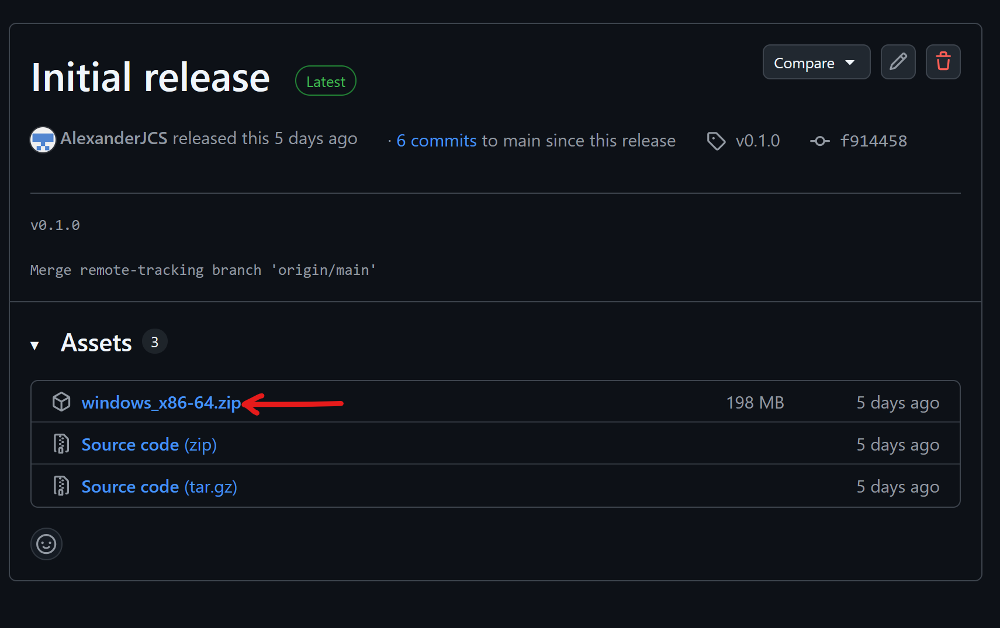
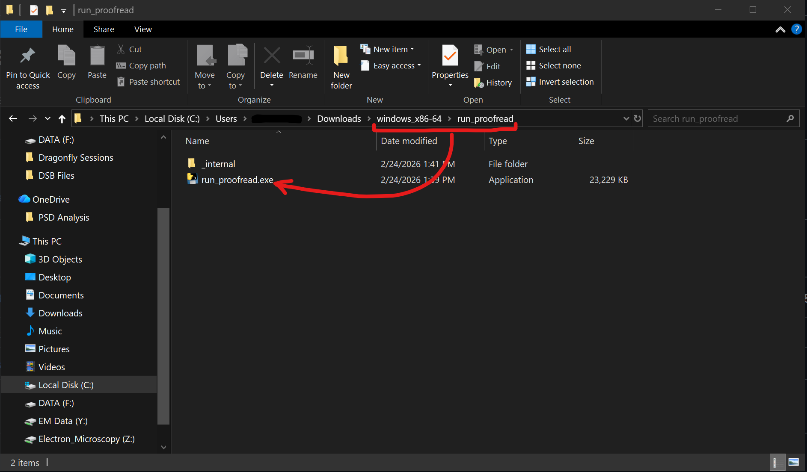

# Installation Guide

## Binary Installation (easiest): Windows
**Step 1:** Navigate to the [latest release](https://www.github.com/alexanderjcs/dsb-proofreader/releases/latest).

**Step 2:** In the "Assets" section, click on the file named `windows_x86-64.zip` (or similar) to download it.



**Step 3:** Extract the zip file you just downloaded.

**Step 4:** Navigate in the new directory → run_proofread.

**Step 5:** Double-click run_proofread.exe



> **ℹ️ Info:** Windows may present you with a dialog that prevents an unrecognized app from starting. If this popup shows, **click "More info" then click "Run anyway."** This popup occurs because the executable is not digitally signed and is not widely distributed. 

After a few seconds, you should see the proofreader tool open.

## Python Installation: Windows, macOS, Linux

DSB Proofreader supports macOS and Linux but does not have a binary build available. Instead:

**Step 1:** Ensure [Python 3.13](https://www.python.org/downloads/latest/python3.13/) is installed. 
**Step 2:** Navigate to the [latest release](https://www.github.com/alexanderjcs/dsb-proofreader/releases/latest) and download the source code (zip)
**Step 3:** Extract the source code and start a terminal session in the new directory.

**Step 4:** Create a virtual environment and activate it

```bash
$ python3.13 -m venv venv
$ source venv/bin/activate
```

**Step 5:** Install dependencies
```bash
$ pip install -r requirements.txt
```

**Step 6:** Run the program
```bash
$ python run_proofread.py
```

To run the program in the future, make sure that you activate the virtual environment before running the program:
```bash
$ source venv/bin/activate
$ python run_proofread.py
```
