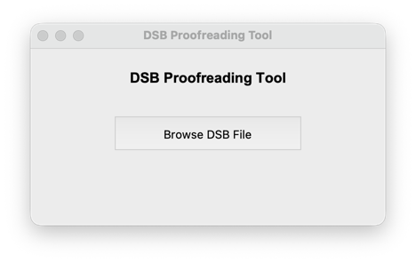
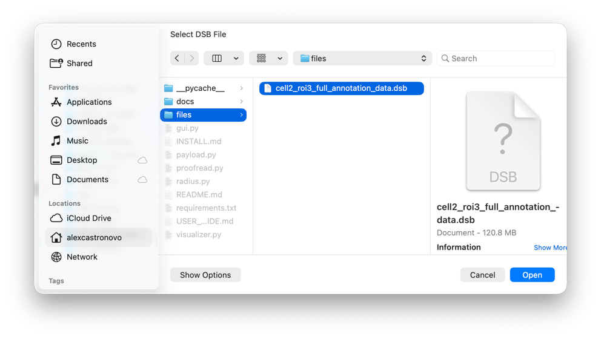
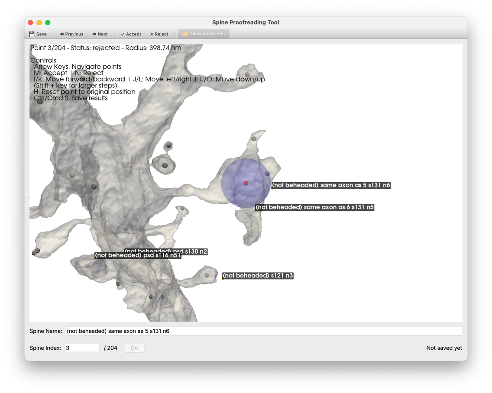
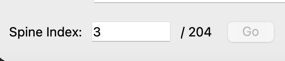
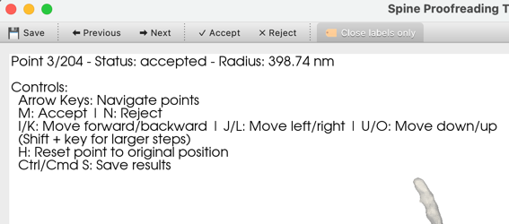
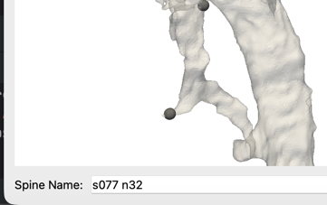
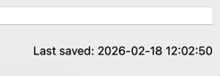
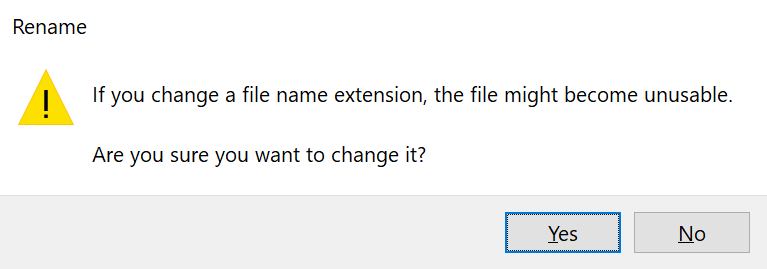
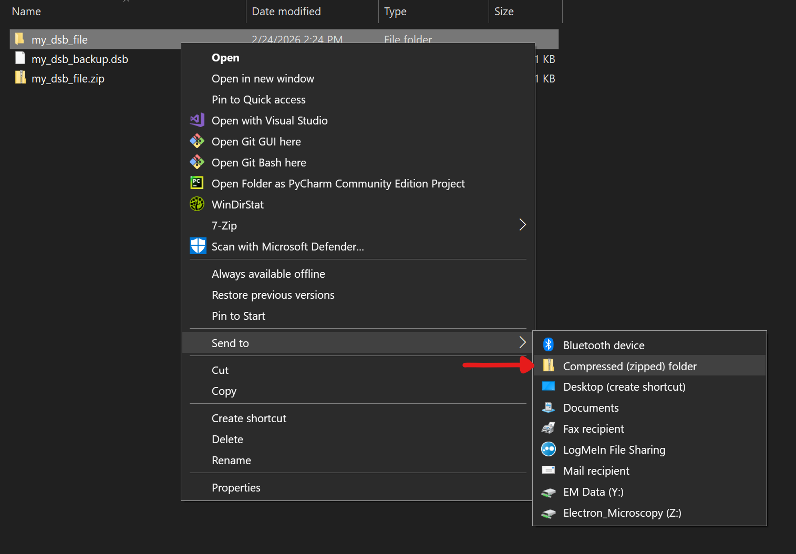

# User Guide

This user guide will explain how to proofread spines. At the end, you will have a CSV containing head center names, radii, 3D positions, index, and label (assigned by you, a human proofreader).

Ensure that you have already [installed the proofreading software](INSTALL.md) and have a `.dsb` file.

## Opening a DSB file

First, run the proofreader. You'll see a menu with a button prompting you to open a DSB file. Click it.

Then, choose a DSB file to load.

The program may freeze or disappear for up to one minute while it loads the DSB file and initializes the visualization.

## Proofreader Menu

After you open a .dsb file, you will see a window visualizing the 3D neuron data.

Use the following controls to move the camera:

| Action             | Control                                                |
|--------------------|--------------------------------------------------------|
| Orbit Camera       | Left Click + Drag                                      |
| Translate Camera   | Shift + Left Click + Drag OR Middle Mouse Click + Drag |
| Zoom Camera        | Right Click + Drag OR Scroll Wheel                     |
| Rotate Camera      | Ctrl/Cmd + Left Click + Drag                           |
| View Entire Neuron | R                                                      |

Use the following controls to change how the visualization looks:

| Action                   | Control |
|--------------------------|---------|
| Toggle 3D Glasses Mode   | 3       |
| Turn On Wireframe Mode   | W       |
| Turn Off Wireframe Mode  | S       |

> ℹ️ **Info:** 3D glasses mode may not work on all platforms, since it requires GPU driver support. 3D glasses mode may be work more consistently on Apple hardware. It is confirmed to work on an M4 MacBook Pro.

### Accepting or rejecting spines

You can accept or reject the currently visualized spine head by clicking the "Accept" or "Reject" buttons in the toolbar, which is on the top of the proofreader window.

You may also use the following keyboard shortcuts:

| Action                  | Control |
|-------------------------|---------|
| Accept Spine Head       | M       |
| Reject Spine Head       | N       |

### Moving to the next spine head

To proofread the next or previous spine head, use the "Previous" or "Next" buttons in the toolbar.

You may also use the left and right arrow keys to move to the previous or next spine head.

The buttons and arrow keys wrap around. For example, advancing from the final spine head displays the first, and moving backward from the first displays the final.

### Jumping to a spine head

You may jump to a given spine head index by editing the value in the "spine index" field on the bottom of the proofreader window. Then click "Go" or use the Enter key to jump to that spine.

### Adjusting spine head position

If the spine head position requires adjusting (e.g., it is not perfectly in the head center), you may use the following controls to modify the spine head position.

| Action                     | Key |
|----------------------------|-----|
| Move head center forward   | I   |
| Move head center backward  | K   |
| Move head center left      | J   |
| Move head center right     | L   |
| Move head center down      | U   |
| Move head center up        | O   |
| Reset head center position | H   |

These controls are relative to the camera view. You may use the Shift key while performing these controls to move the head center a larger distance per step.

### The status text

The status text in the top left corner of the 3D visualizer indicates the status of the currently visualized dendritic spine and a reminder for some proofreader-specific keyboard shortcuts.

"Point 3/204" indicates that the proofreader is visualizing spine head ID 3 (out of 204 spines).

"Status: accepted" means that you accepted this spine head. It may also show "Status: rejected" or "Status: unlabeled."

"Radius: 398.74 nm" shows the radius, in nanometers, that DSB computed for this spine head.

### Naming a spine head

Spine heads are automatically assigned the name of the nearest label. Sometimes the name is incorrect or undefined if there are too many or not enough labels close to the spine head. 

You can adjust the name of the currently selected spine head by editing the text box on the bottom of the window.

### Saving

You may use the "Save" button in the toolbar or the keyboard shortcut Ctrl/Cmd + S to save. It is recommended to save often.

> **⚠️ Warning:** The first save may take several minutes because the proofreader needs to compute spine head radii for all points. While saving for the first time, the window will freeze. Do not close it to avoid losing progress.  Any later saves should be near instant.

You can see the last time you saved in the session on the bottom right of the proofreader window. 

If you reload a dsb file after saving, the proofreader will remember all spine head names, accepts/rejects, and spine head position adjustments that you made.

After saving, the proofreader creates a new .csv file in the same directory as the loaded .dsb file. The .csv file contains all necessary information for further data analysis.

### Rolling back to a previous save

You may roll back a .dsb file to a previous save by modifying the content of the .dsb file itself.

**Step 1:** Make a backup (copy) of the DSB file to modify.
**Step 2:** Rename the .dsb file to a .zip file. There should *not* be a .dsb file extension. 

> **ℹ️ Info:** Windows may warn that changing a file extension may make the file unusable. In this case, changing the file extension is safe. Click "Yes" to change the filename anyway.

**Step 3:** Extract the zip file and open the extracted folder.

> **❗ Critical:** Do not rename *any* files or delete any non-.csv files in this folder. Doing so will corrupt the .dsb file.

> **ℹ️ Info:** If you saved this DSB file before, you will see several .csv files with a timestamp at the end of their filename. Timestamps are in the format YYYYMMDD_HHMMSS. These are all the DSB saves.

**Step 4:** Identify the .csv file to roll back to.

**Step 5:** Delete all .csv files with a timestamp *after* the .dsb file you are rolling back to.

**Step 6:** Go back to the directory containing your .dsb files. Recompress the folder to a .zip.

**Step 7:** Rename the newly compressed .zip file to a .dsb file. Windows may warn you about changing the file extension. Click "Yes" to change the file extension anyway.

**Step 8:** Open the new file in the DSB proofreader. If the proofreader cannot open the file, revert to your backup .dsb file and try these steps again. If it still doesn't work, contact [open an issue](https://github.com/AlexanderJCS/dsb-proofreader/issues/new) or Alex Castronovo for help.
